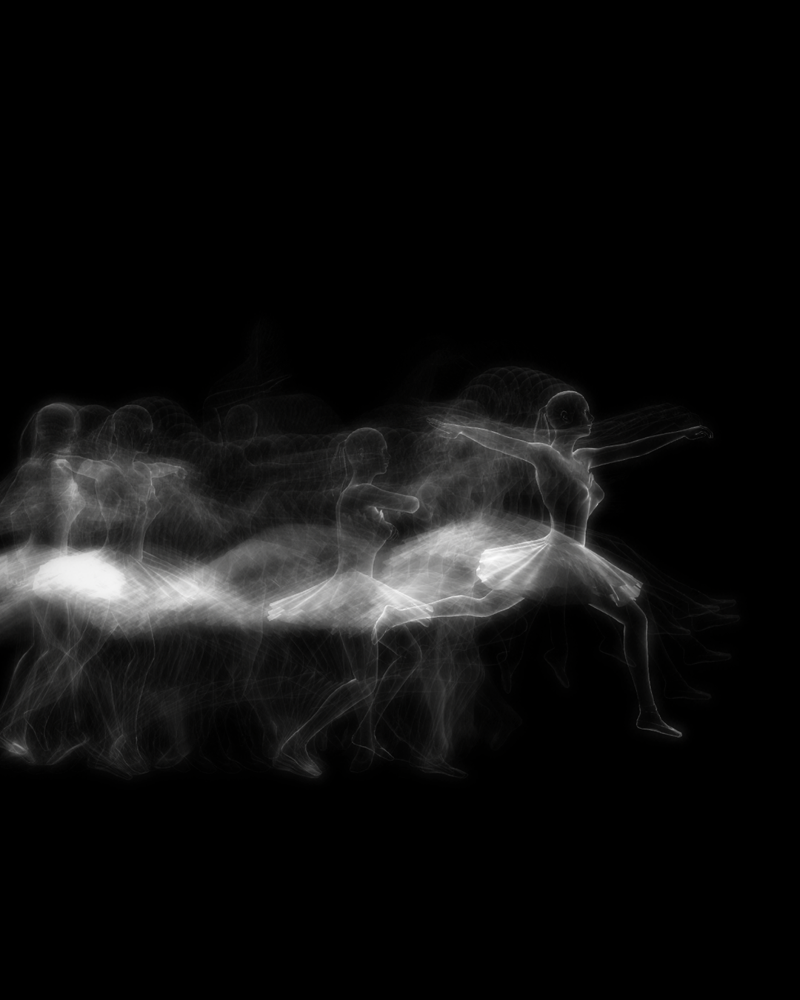

# Poise in Motion

[**Live Demo**](https://momentchan.github.io/Poise-In-Motion/)

Poise in Motion is a real-time visual system that captures and visualizes the flow of movement across time, creating layered traces that overlap, shift, and dissolve — all rendered live in the browser.

## Overview
The system is built with React, Three.js, and a custom rendering pipeline using GLSL shaders.
It leverages a multi-pass rendering approach to blend motion history, generate bloom effects, and apply surface textures, producing visuals that continuously evolve with time and interaction.

   

## Feature
- Custom real-time rendering pipeline in Three.js
- Motion trail accumulation with ping-pong framebuffers
- Real-time blending of present and past frames
- Bloom / glow effects for bright areas
- Texture overlay for surface depth
- Fully interactive and time-responsive visuals

## Dependencies
- React
- Three.js
- React Three Fiber
- GLSL Shaders
- Vite

## Getting Started

### 1. Clone the repository

### 2. Install dependencies
npm install

### 3. Run the development server
npm run dev

Then open http://localhost:5173 in your browser.
